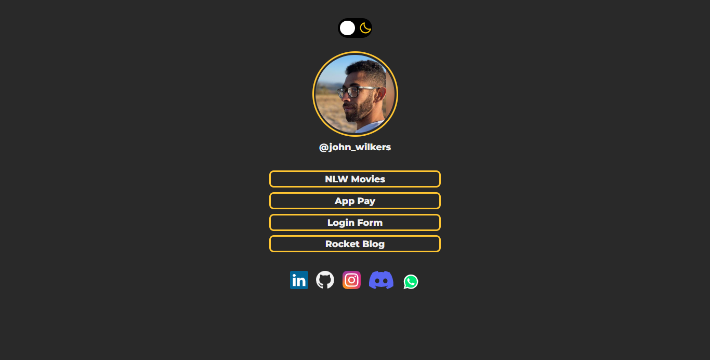

<h1 align="center"> Theme Switcher </h1>

Aplicação desenvolvida para submissão no discover, programa para ensino de tecnologias WEB promovido pela Rocketseat.

🔗 <a href="https://johnwilker.github.io/themeSwitcher">Clique aqui para acessar a página do projeto</a>

  <a href="#-tecnologias">Tecnologias</a>&nbsp;&nbsp;&nbsp;|&nbsp;&nbsp;&nbsp;
  <a href="#-projeto">Projeto</a>&nbsp;&nbsp;&nbsp;|&nbsp;&nbsp;&nbsp;
  <a href="#-layout">Layout</a>&nbsp;&nbsp;&nbsp;|&nbsp;&nbsp;&nbsp;

 

  
  

## 🚀 Tecnologias

Esse projeto foi desenvolvido com as seguintes tecnologias:

- HTML e CSS
- JavaScript

## 💻 Projeto

O Theme Switcher é um ícone disposto na página que possibilita a alteração do tema aplicado na página entre o "dark" e o "light", alterando não somente a cor do plano de fundo entre uma cor escura e uma cor clara como também as cores das bordas e dos textos dos elementos dispostos nas páginas, incluindo ícones SVGs que possuem apenas uma ou duas cores sólidas harmonizando as cores de ambos os temas para todo o layout da página.

## 🔖 Layout

Você pode visualizar o layout do projeto através [DESSE LINK](https://www.figma.com/file/RnnO1AFMgCgJV1FcxQa9oB/DD-%2F-Theme-Switcher?node-id=3%3A2). É necessário ter conta no [Figma](https://figma.com) para acessá-lo.

---

Feito com ♥ by John :wave: [Participe da comunidade Rocketseat!](https://discord.gg/rocketseat)
